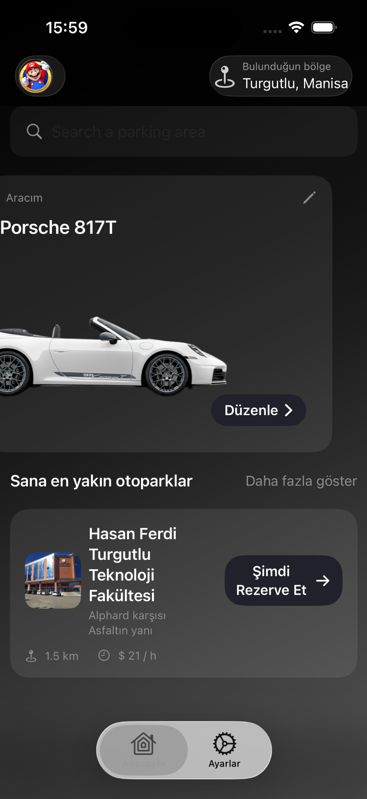
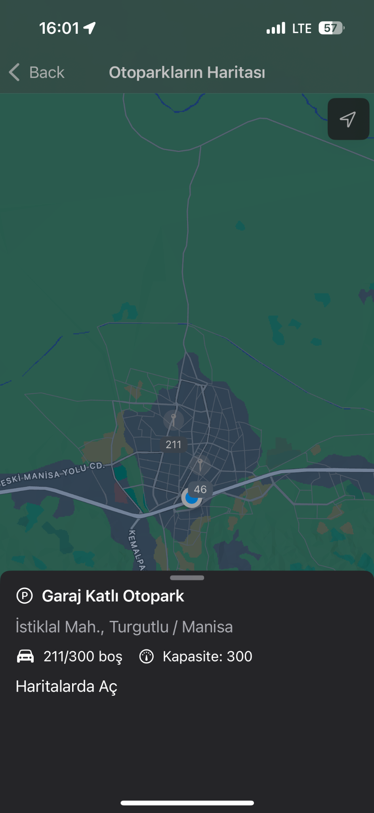
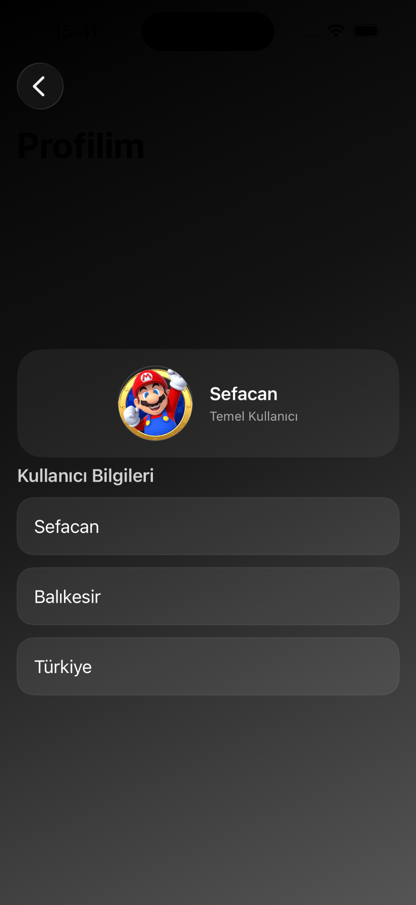
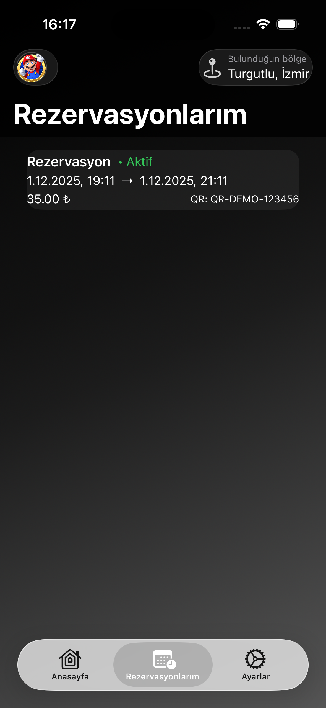

# 📱 Smart Parking iOS App  
SwiftUI + MVVM + Clean Architecture ile geliştirilen akıllı otopark mobil uygulaması.

Bu proje, kullanıcıların otoparkları harita üzerinden görüntüleyip rezervasyon yapabilmesini sağlayan bir mobil uygulamadır. Backend tarafı Spring Boot ile geliştirilmiş olup uygulama REST API üzerinden haberleşir.

---

## 🚀 Özellikler
- 🔐 **Kullanıcı Girişi (Auth)**
- 🗺️ **Harita Üzerinde Otopark Gösterimi**
- 📄 **Otopark Listeleme**
- 🅿️ **Rezervasyon Oluşturma**
- 📋 **Kullanıcının Rezervasyonlarını Görüntüleme**
- 🎨 Modern SwiftUI tasarımı
---


# 🖼️ Uygulama Görselleri

> Ekran görüntüleri uygulamanın gerçek çalışır haline aittir.

### 🏠 **Ana Sayfa**


### 🗺️ **Harita Görünümü**


### 👤 **Profil**


### 📄 **Rezervasyonlarım**

---

## 🏗️ Mimarî Yapı

Uygulama **MVVM + Clean Architecture + Feature-Based** yapıdadır.

### ⭐ Katmanlar
1. **App**  
   Uygulamanın giriş noktası ve global appearance yönetimi.

2. **Core**  
   - **Models** (DTO, domain modelleri)  
   - **Repositories** (Protocol tanımları)  
   - **Services** (Network, Session, Storage, Default repository implementasyonları)

3. **Presentation**  
   - SwiftUI View’lar  
   - ViewModel’ler  
   - Feature bazlı klasörleme: `Auth`, `ParkingMap`, `Reservations`, `Home`

---
## 🔌 API İletişimi

Tüm ağ istekleri **URLSession** tabanlı **APIClient** üzerinden yönetilir.

- `APIClient` → HTTP katmanı  
- `AuthRepository`, `ParkingRepository`, `ReservationRepository` → protokoller  
- `DefaultAuthRepository`, `DefaultParkingRepository` → implementasyon  

---
📡 Backend

Backend Spring Boot ile geliştirilmiştir:
https://github.com/MAErd4141/SmartParkingPrototype

---
## 🛠️ Kurulum

1. Repoyu klonlayın:
```bash
git clone https://github.com/kullanici/smart-parking-ios.git

    Xcode ile açın:

open OtoparkDeneme1.xcodeproj

    Backend base URL’ini APIConfig.swift içinde yapılandırın.

    Çalıştırın:

    iPhone Simulator

    veya gerçek cihaz

